# SafeScore Operator SOP

Audience: Golden Era SafeScore operations

Primary operator: Brandon Bell

Applies to: the current production release

Purpose: run SafeScore consistently without confusing automated processing with work that still requires human judgment.

## Before you start

- Use the staff console for agency work and the portal only when verifying what a carrier sees.
- Never put an FMCSA Portal PIN in email, ordinary chat, notes, screenshots, or a report.
- Never promise that a score change is removable before reviewing the underlying record and evidence.
- Never treat an AI draft as a finished filing, playbook, or client report.
- Client-facing email remains in dry-run mode until the go-live checklist is approved and executed by a human.
- The examples in this document use only `ZZ Lifecycle Carrier (TEST)`. Do not add real client information to this public document or its images.

### Current operational limitations

These are current product limitations, not optional operator steps:

| Area | Current behavior | Operator rule until corrected |
| --- | --- | --- |
| Console alert triage | The dashboard counts unread, undismissed alerts, but the console does not show an alert-detail/read/dismiss view. | Use the dashboard signal to open the client, then inspect Monitoring, Violations, Remediation, and Cases. |
| CPDP determination | “Record determination” advances the status but does not capture the outcome or determination date. | Preserve the determination outside SafeScore and do not close the case until the outcome/date capture gap is resolved or separately documented. |
| Report delivery | Reports can be drafted, edited, marked reviewed, and printed. There is no operator Send control, and the existing send API does not enforce reviewed status. | Do not attempt to send or manually change a report to `sent`. Leave the approved report `reviewed` until the reviewed-only send workflow is repaired. |
| Playbook publishing | Generate/Regenerate creates a new version that immediately becomes the latest portal version. There is no draft/review/publish state. | Review the Lane C source data before clicking Generate or Regenerate. Treat the click as publication. |
| PIN handoff after onboarding | A PIN can be entered securely during writable onboarding. After onboarding, the portal request explains where to find it but offers no secure online handoff, and the console offers no recording control. | Never accept it by ordinary email. Escalate for an approved secure handoff; do not place the PIN in another field as a workaround. |

---

## 1. System map

SafeScore is GEIA's carrier-safety operations platform. It combines public FMCSA records, client-supplied evidence, case work, reporting, and Total Safety compliance records so GEIA can monitor change, prepare defensible work, and show the carrier what needs attention. It does not replace FMCSA, make legal determinations, or remove the operator's judgment.

### The two surfaces

| Surface | Address | Who uses it | What belongs there |
| --- | --- | --- | --- |
| Staff console | `/console` | GEIA staff only | Client setup, analysis review, challenge work, requests, monitoring, compliance operations, reports, account access |
| Client portal | `/portal` | Linked carrier users only | SafeScore Home, coaching Playbook, Activity, Documents/requests, Account, and Total Safety Compliance |

Staff and client sessions are deliberately separated. If a portal user opens a console route, or staff opens a portal route, SafeScore shows an access-mismatch screen. Sign out and use the correct account; do not work around it with shared credentials.

### How work moves through SafeScore

```text
Public FMCSA sources
        |
        v
Daily refresh -> snapshot policy -> alerts -> challengeability assessment
        |                         |
        |                         v
        |                  typed evidence requests
        |                         |
        v                         v
Monitoring/Remediation      carrier upload or answer
        |                         |
        |                         v
        |                  automatic reassessment
        |                         |
        +-------------> operator judgment
                              |
              DataQ / CPDP filing, coaching, reports
```

### What runs automatically

| Automation | When it runs | What it does | What it does not do |
| --- | --- | --- | --- |
| Daily monitoring refresh | 6:00 AM Pacific for active Monitor, Remediate, and Total Safety clients | Refreshes public FMCSA data, evaluates whether to save a burden snapshot, and logs the run | It does not refresh Assessment clients on schedule |
| Alert generation | During the daily refresh | Raises alerts for a new violation, inspection, crash, or OOS change; notifies operations | It does not decide whether a filing should be made |
| Lane B assessment | During activation and daily refresh for entitled tiers | Assesses new violations, creates typed evidence requests when supported, and retries submitted violation-evidence reassessment | It does not certify evidence or file DataQs |
| Violation-evidence reassessment | Immediately after an upload to a violation-linked Lane B request, with bounded daily retry after a failure | Re-runs challengeability and marks that evidence applied or insufficient | Generic, PIN, and compliance uploads do not run challengeability |
| Intake-question answer | When a carrier answers a question-type request | Records the answer, notifies operations, and creates the follow-up evidence request when the answer qualifies | The answer itself is not evidence and does not run challengeability |
| Client-request reminders | During the daily monitoring run when an open client-owned request is due | Records a dry-run or delivery attempt, advances the next due date by seven days, and stops after reminder 3 | It never sends outside the configured email layer or duplicates the same request/reminder number |
| Age-out lifecycle | After each monitored client refresh | Cancels an open violation-linked evidence request when the violation leaves the 24-month scoring window | It does not delete the violation or a filed case |
| Carrier enrichment | Cadence-gated inside the daily run | Refreshes authoritative carrier-profile fields when due | It does not overwrite protected operator/client enrichment with null public-source values |
| MCS-150 truth-up | Quarterly gate inside the daily run for Total Safety | Compares attested operational values to public census and follows the truth-up lifecycle | It never files an MCS-150 or changes billing |
| Compliance expiration sweep | Daily for Total Safety | Evaluates CDL, medical certificate, annual MVR, vehicle inspection, and Clearinghouse clocks; creates one operations digest per client/day; creates certain 30-day renewal requests | It does not update a document date just because a request was fulfilled |
| Operations notifications | On activation, onboarding tier change, evidence upload, intake answer, monitoring alert, and compliance digest | Records the event and delivery result in the activity log and links staff to the relevant console page | In dry-run mode it logs rather than sends live email |

### What always needs operator judgment

- Confirm payment before a manual activation.
- Review an onboarding tier change before activation.
- Decide whether a crash is an appropriate CPDP candidate.
- Confirm police-report identity and evidence quality.
- Review every AI narrative and remove unsupported claims.
- Obtain and verify filing authorization.
- File DataQ and CPDP requests in the external FMCSA/DataQs system.
- Review submitted evidence and decide whether more is needed.
- Decide which Lane C priorities should become the current coaching playbook.
- Review and approve every report before client delivery.
- Maintain driver, vehicle, DQF, and Clearinghouse operational records.
- Handle FMCSA Portal PINs through an approved secure channel.

### Console route index

Replace `{client_id}`, `{case_id}`, and `{report_id}` with the record selected in the UI.

| Work area | Route |
| --- | --- |
| Dashboard and client list | `/console` |
| Client overview | `/console/clients/{client_id}` |
| Violations | `/console/clients/{client_id}/violations` |
| Remediation and Lane C | `/console/clients/{client_id}/remediation` |
| Playbook | `/console/clients/{client_id}/remediation/playbook` |
| Cases summary | `/console/clients/{client_id}/cases` |
| CPDP workbench | `/console/clients/{client_id}/cpdp` |
| CPDP case | `/console/clients/{client_id}/cpdp/{case_id}` |
| DataQ workbench | `/console/clients/{client_id}/dataq` |
| Requests | `/console/clients/{client_id}/requests` |
| Monitoring | `/console/clients/{client_id}/monitoring` |
| Total Safety compliance | `/console/clients/{client_id}/compliance` |
| Reports | `/console/clients/{client_id}/reports` |
| Account, portal access, and PIN status | `/console/clients/{client_id}/account` |
| Cross-client activity | `/console/activity` |

---

## 2. Daily rhythm

### Morning review

Allow about 15 minutes before starting case work.

1. Open `/console`.
2. Read the four dashboard counts: Active, Onboarding/activation, Needs attention, and Total.
3. Open every carrier listed under Needs attention.
4. On each carrier, open Monitoring and note:
   - last successful check and source;
   - whether the latest check created a snapshot or reported no change since the last snapshot;
   - latest saved burden and delta from the prior saved snapshot;
   - violation, inspection, crash, and OOS-count changes;
   - which BASIC categories moved.
5. Open Violations and Remediation to identify the records behind the movement.
6. Open Cases for crash candidates or existing DataQ/CPDP work.
7. Open Requests for due evidence, PIN, MCS-150, and compliance asks.
8. For Total Safety, open Compliance and address expired and 7/30/60-day items.

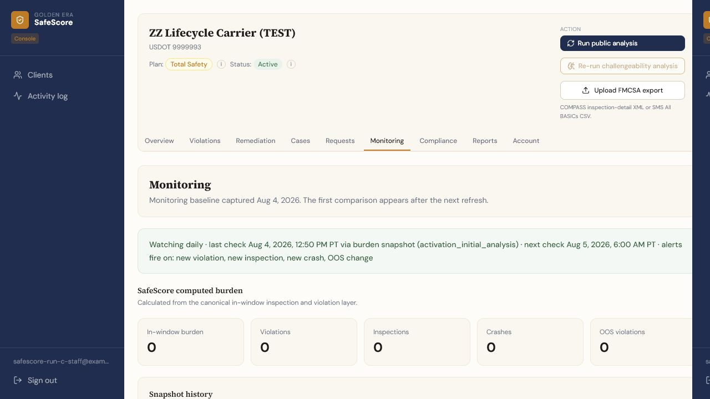

Because the dashboard has no alert-detail/dismiss view, Needs attention is a signal, not a complete queue. The client’s Monitoring and work tabs are the source of the operational explanation.

A daily check does not guarantee a new snapshot row. SafeScore saves a snapshot when tracked metrics change or the maximum-age policy requires one. When the run is unchanged, the Monitoring header shows the check time separately from the most recent saved snapshot.

### Interpret a burden change in this order

1. **Confirm the comparison.** Read both snapshot timestamps and sources. Two snapshots can exist on the same day; use the full timestamp, not just the date.
2. **Locate the BASIC movement.** Determine whether the delta sits in Unsafe Driving, Hours of Service, Vehicle Maintenance, Crash Indicator, or another category.
3. **Inspect the underlying rows.** Look for a new violation, inspection, crash, changed OOS fact, corrected source record, or no row-count change at all.
4. **Classify the movement.**
   - **New source event:** review challengeability and whether an evidence request was created.
   - **Public-source correction:** verify the exact inspection/report identity before treating it as case work.
   - **Time decay:** weighted burden can fall while the record remains in the 24-month window.
   - **Age-out:** when a violation crosses out of the window, its points reach zero and an open evidence request tied to it is cancelled.
   - **Operational burden:** route it to Lane C coaching/maintenance rather than inventing a filing theory.
5. **Choose the next workbench.**
   - crash preventability -> Lane A / CPDP;
   - factual or attribution evidence -> Lane B / DataQ;
   - coaching, maintenance, or process control -> Lane C / Playbook;
   - no operator action -> document the interpretation and continue monitoring.

### Reading common signals

| Signal | What it can mean | What to do |
| --- | --- | --- |
| Burden increased and a new violation exists | New weighted exposure | Review the violation, challengeability tier, evidence class, and existing request before contacting the client |
| Burden increased without a new row | Source correction, OOS change, or a changed calculation input | Compare timestamps/source facts; do not promise a challenge |
| Burden fell with unchanged counts | Time-weight decay | Note the improvement honestly; the record still exists until it ages out |
| Violation count fell | A record aged out or source data changed | Verify the violation date and snapshot source; confirm any linked request was cancelled for age-out |
| Crash appeared | New crash record | Open Cases/CPDP, confirm tow-away and window facts, then apply human review |
| Seven or more similar requests appear | Context or dedupe problem may exist | Stop and verify violation codes, dates, and linked IDs before asking the carrier for duplicates |

Never call computed burden an official FMCSA score. It is SafeScore’s operational burden view built from the carrier’s source records.

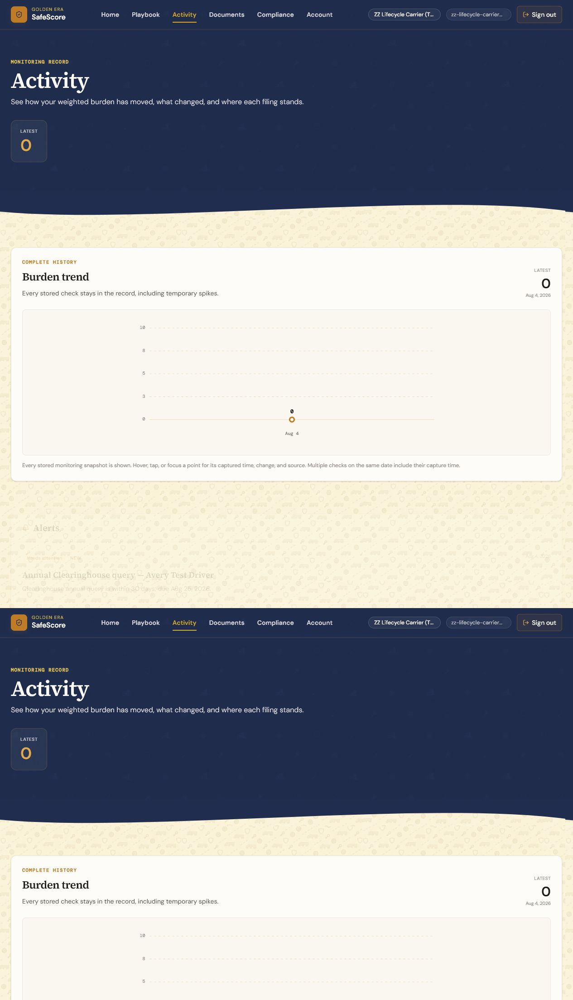

### Lane C operating note

Review family counts, points, inflow, and current violation rows before using **Generate playbook** or **Regenerate playbook**. The newly generated version becomes immediately visible at `/portal/playbook`; there is no separate Publish button or approval state.

---

## 3. Onboarding a new carrier

### A. Create the client in the console

1. Open `/console`.
2. Select **+ Add client**.
3. Enter the legal/company name and USDOT number.
4. Add the MC number, driver count, contact name, and contact email when known.
5. Select the service tier GEIA actually sold:
   - Assessment;
   - Monitor;
   - Remediate;
   - Total Safety.
6. Verify the displayed price estimate. Total Safety uses the editable service-plan driver count; do not substitute a roster count or FMCSA census count.
7. Select **Add client**.

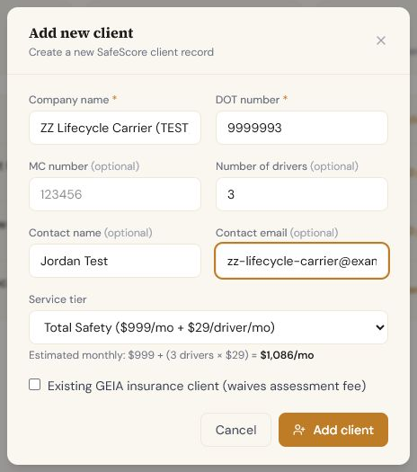

### B. Create portal access

1. Open the new client.
2. Open **Account**.
3. In **Portal access**, verify the contact email.
4. Use **Create invite**. The invitation is time-limited.
5. Read the result:
   - `sent` means the provider accepted the email;
   - `dry_run` means no live email was sent and the setup URL must be handed over through the approved test channel;
   - `failed` means use the returned setup URL and investigate delivery.
6. Use **Revoke** if the address is wrong or the invitation should no longer be valid. Create a fresh invite rather than reusing a revoked or expired link.

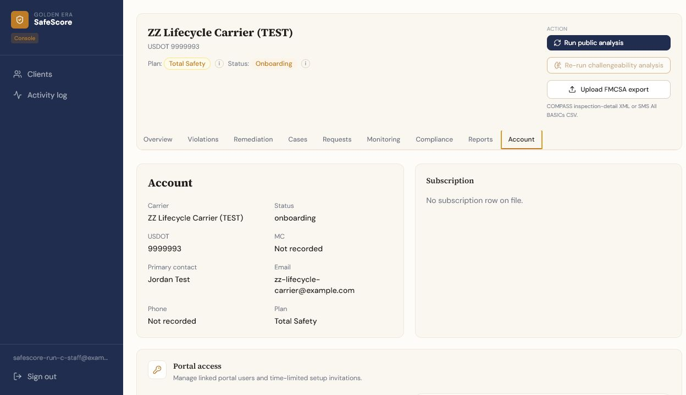

Do not create an invite before confirming the assigned tier. The invitation preserves the tier GEIA assigned.

### C. What the carrier experiences

The carrier opens the unique `/setup` link and creates a password. The email is fixed to the invited address.

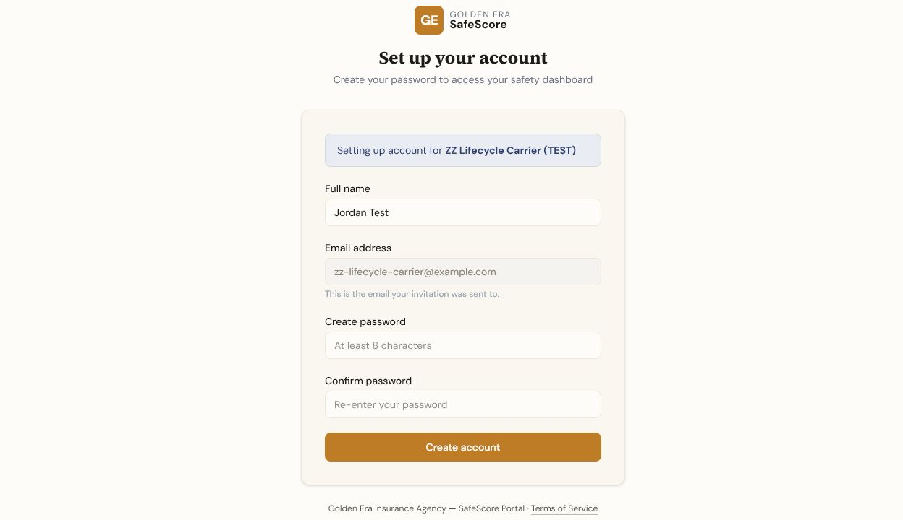

The four onboarding steps are:

1. **Confirm Company** — verify the company/USDOT and enter the working contact.
2. **Fleet Profile** — operating radius, states, current driver count, ELD provider, safety contact, and citation-dismissal intake question.
3. **Authorization** — service agreement, FMCSA data access, filing authorization when required by the plan, and optional FMCSA Portal PIN.
4. **Activate** — confirm service choice. Recurring plans begin Stripe checkout in the portal; Assessment submits for staff payment confirmation. A recurring payment confirmed outside Stripe uses the separate console action described below.

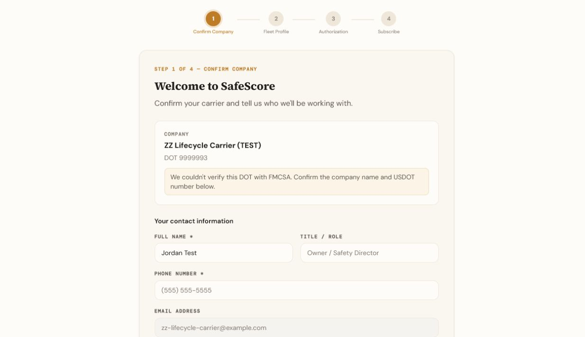

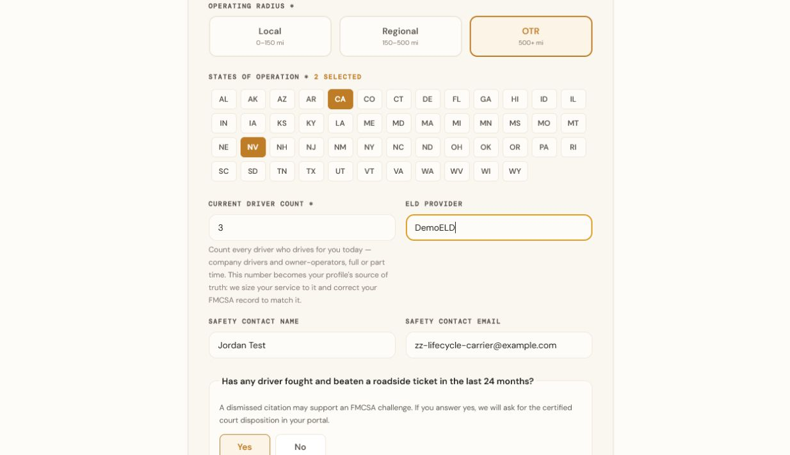

The driver count entered here is the service-plan billing input. Later Total Safety roster changes do not change it.

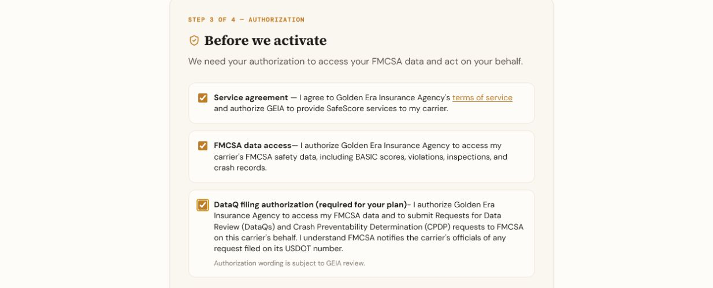

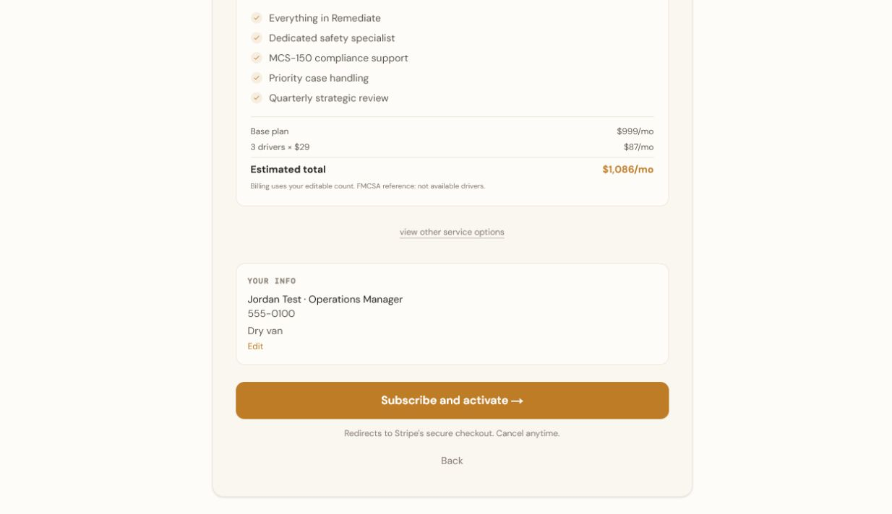

After onboarding reaches a post-onboarding lifecycle state, writable onboarding is locked. A linked user for an already active client goes to the portal instead of being allowed to overwrite live client data.

### D. If the carrier changes tier in Step 4

SafeScore records the originally assigned tier and the newly selected tier and creates an operations notification. Before activation:

1. Open the client Account and confirm the selected tier.
2. Compare assigned versus selected.
3. Confirm price and scope with the carrier through the approved sales process.
4. Activate only after the intended tier and payment path agree.

Treat the notification as a sales and fulfillment follow-up, not automatic authority to change a contract.

### E. The two activation paths

| Path | When to use it | Operator action |
| --- | --- | --- |
| Stripe checkout | Recurring Monitor, Remediate, or Total Safety subscription paid through Stripe | Carrier selects **Subscribe and activate**. Stripe’s paid checkout webhook/sync performs activation. Do not also run manual activation. |
| Manual confirm-payment | Assessment payment or a subscription payment confirmed outside Stripe | For Assessment, the action appears in `awaiting_activation`. For a recurring subscription, it appears after agreement-complete onboarding while the client is still `onboarding` or `prospect`. Select **Confirm payment & activate** only after payment is confirmed. Stripe-linked subscriptions are deliberately rejected by this path. |

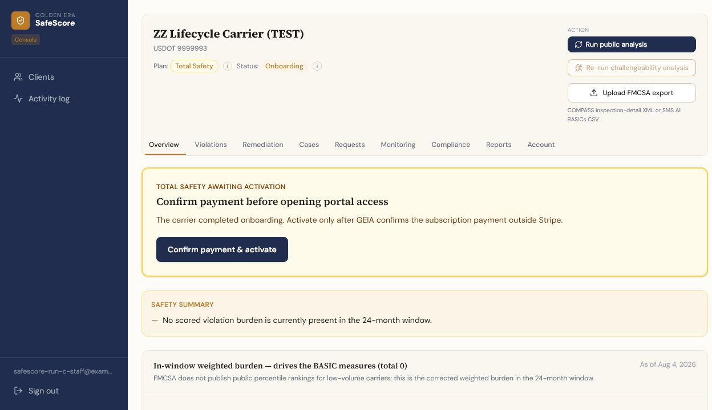

### F. What should fire after activation

Both activation paths should run the same idempotent initialization:

1. Status becomes active and portal access opens.
2. SafeScore runs the first public-source refresh.
3. It saves the first burden snapshot when appropriate.
4. It runs challengeability for the service tier.
5. It creates a client “SafeScore is live” delivery result.
6. It creates the operations activation notification.
7. It writes start/completion activity rows with analysis counts and delivery metadata.

In current dry-run mode, email delivery is logged but not sent. If activation reports an error, read the real error and investigate; do not assume the next morning’s cron will repair a failed activation initialization.

### G. Activation verification

Before considering onboarding operationally complete, verify:

- client status is active;
- selected tier is correct;
- subscription state matches the payment path;
- portal user is linked;
- first analysis and snapshot results exist, or the activity explains why a non-resolving test DOT produced no public rows;
- `client_activation_initialization_started` and completion activity are present;
- an `operations_notification_email` activity exists for the activation event;
- the client can open the entitled portal routes.

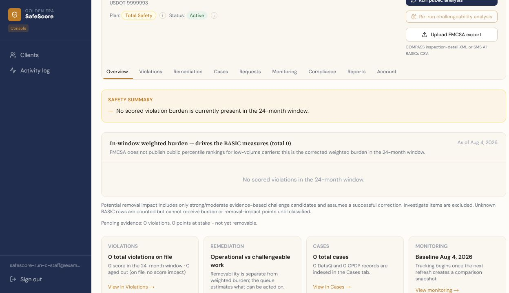

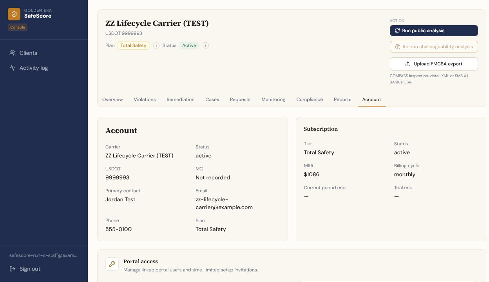

---

## 4. Working Lane A — CPDP

At publication, three real crash candidates await workup. Identify them in the live console; this public SOP intentionally contains no carrier names, DOT numbers, crash identifiers, or scores.

### What qualifies for the review queue

The workbench identifies a tow-away crash inside the current 24-month window that does not already have a CPDP case. This is a review candidate, not an eligibility determination.

### Workbench sequence

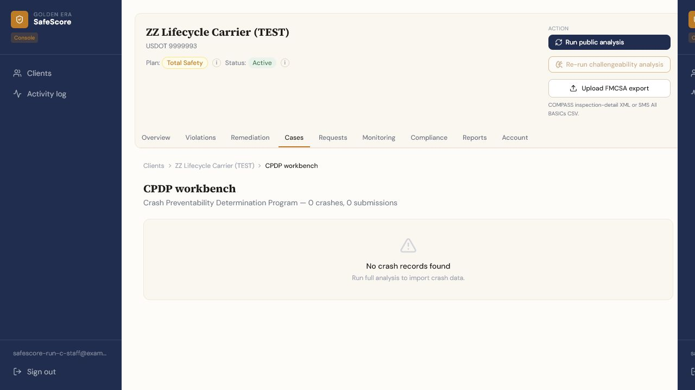

1. Open **Cases**, then **CPDP workbench** at `/console/clients/{client_id}/cpdp`.
2. Review the crash date, state, fatality/injury/tow-away facts, and source identifier.
3. Select **Create CPDP submission** once the crash is worth investigating. Creation is idempotent for the same client/crash.
4. The draft remains at **Awaiting police report — upload or LexisNexis delivery** until a real PAR is linked. Do not make an eligibility determination from crash metadata alone.
5. Obtain the PAR through one of the two intake paths:
   - manually upload the PDF or image in the CPDP workbench; or
   - use the secret-gated LexisNexis delivery integration after its account secret is configured.
6. SafeScore stores the PAR in the client document vault, links it to the crash and case, detects a PDF text layer, and uses the vision-capable path for scanned PDFs or images.
7. Review all four identity checks: report-number system, crash date, location, and carrier/USDOT. Local PAR and FMCSA MCMIS report numbers are different systems; corroborate the event rather than forcing the numbers to match.
8. Review every one of FMCSA's current 21 eligibility questions. Each AI answer must show a PAR excerpt when supported and one line of reasoning.
9. Override an AI answer only with a written reason, then approve the assessment. Approval atomically records reviewer/timestamps, populates the crash and case eligibility fields, and preserves every override in activity history.
10. Edit the PAR-grounded RFD narrative. Do not approve or file a narrative containing a placeholder, `[VERIFY:]`, or `INSUFFICIENT EVIDENCE`.
11. Confirm signed filing authorization is on file. Use an authorization override only when authorized and record the reason.
12. File manually in FMCSA DataQs:
    - locate the crash with FMCSA’s MCMIS crash identifier, not a local PAR number;
    - choose the crash-preventability request and correct crash type;
    - copy the reviewed final explanation;
    - attach the verified evidence;
    - review the federal attestation;
    - submit using the approved carrier authority.
13. Back in SafeScore, record the FMCSA case ID and filing notes, then mark the case filed.
14. Monitor the expected determination window, approximately 60 days.
15. Record the determination and close only after the result is documented.

### Status meanings

| SafeScore status | Meaning |
| --- | --- |
| Draft | Evidence and filing narrative are still being prepared |
| Filed / Pending FMCSA | The request was submitted externally and is awaiting FMCSA |
| Determination | FMCSA has made a determination |
| Closed | Operator work is complete and the result is preserved |

### Current determination gap

The current **Record determination** action only moves the status to Determination. It does not collect outcome or determination date. Until that is repaired:

- retain the authoritative result through the approved case-record process outside this incomplete control;
- do not invent an outcome in narrative text;
- do not treat status alone as proof of the result;
- do not close the case unless the outcome and date can be independently verified.

---

## 5. Working Lane B — Evidence Loop

### The four evidence classes

| Class | When it applies | What SafeScore asks the carrier for |
| --- | --- | --- |
| Wrong attribution | The inspection/violation may belong to the wrong carrier, driver, or vehicle | Vehicle registration; lease/interchange agreement; driver roster for the inspection date; ELD/GPS location records |
| Duplicate | The same inspection or violation may have been recorded twice | VIN or unit record; inspection date/time record; authenticated ELD/GPS/dispatch record |
| Citation dismissed | A citation exists and its final disposition may support the challenge | Certified court disposition |
| Report factual error | A clerical, recording, or observable factual error may exist | Driver’s inspection report; dated photos; repair invoices/work orders |

Unmapped actionable findings and open-case fallback use Report factual error; do not force a stronger class without evidence.

### Automatic request creation

For an entitled client, SafeScore automatically creates a typed request when challengeability is actionable or a qualifying case opens. It:

- links the request to the violation and, when applicable, the case;
- prevents a second open request for the same violation and class;
- includes the potential removable points;
- gives the request a contextual title such as `Certified court disposition — {code} ({short description}, {inspection date})`;
- gives the carrier a plain-language reason for the ask.

Before contacting the carrier, verify the title’s code, description, date, and linked violation. Repeated generic titles are a defect signal.

### Request lifecycle

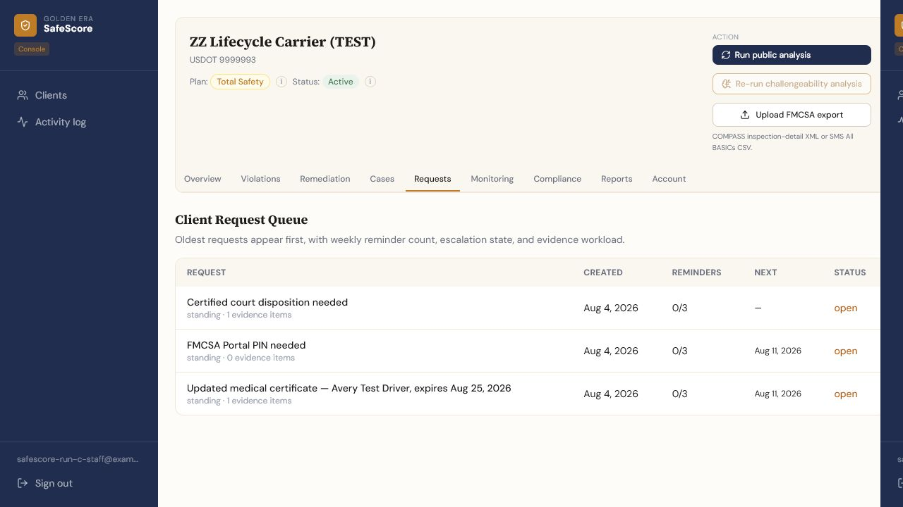

```text
Open -> Submitted -> Applied
                   -> Insufficient -> new/clearer upload -> reassess
Open -> Cancelled when the linked violation ages out
```

1. Review open requests at `/console/clients/{client_id}/requests`.
2. The carrier sees entitled requests under `/portal/documents#needed-from-you`.
3. For a violation-linked Lane B evidence request, the carrier uploads against that specific request. SafeScore attaches the evidence to the linked violation and immediately reassesses.
4. For a question-type request, SafeScore records the answer and notifies operations. A qualifying Yes answer creates or reuses a court-disposition evidence request. If that request is linked to a violation, its upload auto-reassesses; a generic intake follow-up remains pending operator review until it is associated with relevant violation evidence.
5. Generic document, PIN, and compliance-renewal requests follow their own fulfillment workflows and do not run challengeability.
6. A violation-linked evidence request becomes:
   - **Applied** when supported evidence can be applied to the challenge;
   - **Insufficient** when clearer or different evidence is needed;
   - **Submitted** temporarily if reassessment failed and awaits bounded retry.
7. If the evidence improves the challengeability tier, the portal says that it strengthened the challenge.
8. The operator reviews the evidence and decides whether to prepare/file a DataQ. SafeScore never files automatically.

### Citation-disposition intake

The onboarding and existing-client question is:

> Has any driver fought and beaten a roadside ticket in the last 24 months?

A Yes answer creates or reuses a certified-court-disposition evidence request. It may be generic until the operator associates it with the relevant violation evidence. A Yes answer is not proof that the citation was dismissed; obtain the certified disposition.

### Request reminder automation

The daily monitoring cron processes due open requests owned by the client. Each successful reminder attempt increments the count once, schedules the next reminder seven days later, and stops after reminder 3. A concurrent run or replay cannot mint the same `(request, reminder number)` twice.

1. Review the Next reminder and reminder-count columns in Requests.
2. Confirm the `client_request_reminder_email` activity row before saying a reminder was delivered or dry-logged.
3. Under `EMAIL_DRY_RUN`, SafeScore records the intended recipient, subject, reminder number, and dry-run status without sending a live email.
4. If delivery fails or no portal-user email exists, the request remains due for a future retry; do not advance it manually to make the queue look current.
5. After reminder 3, follow GEIA’s escalation procedure. SafeScore will not send a fourth automated reminder.

### Age-out behavior

When a violation exits the 24-month scoring window, the daily refresh closes its open evidence request with the exact reason `violation aged out of scoring window`. The request disappears from Needed from you. The underlying violation and any case remain preserved.

Do not reopen the request merely because it vanished from the portal. Verify the violation date and activity entry first.

---

## 6. FMCSA Portal PIN handling

### When SafeScore needs it

The FMCSA Portal PIN supports authorized DataQ work. It is optional during onboarding and separate from the carrier’s FMCSA data-access and filing-authorization consents.

### Request it

1. Open `/console/clients/{client_id}/account`.
2. Find **FMCSA Portal PIN**. The Yes/No pill indicates whether a value is on file; it never displays the PIN.
3. If absent, select **Request from client**.
4. SafeScore creates a `FMCSA Portal PIN needed` client request and a dry-run email result.
5. The carrier sees the request in Documents with this guidance: log in to `ai.fmcsa.dot.gov` and look under profile settings.

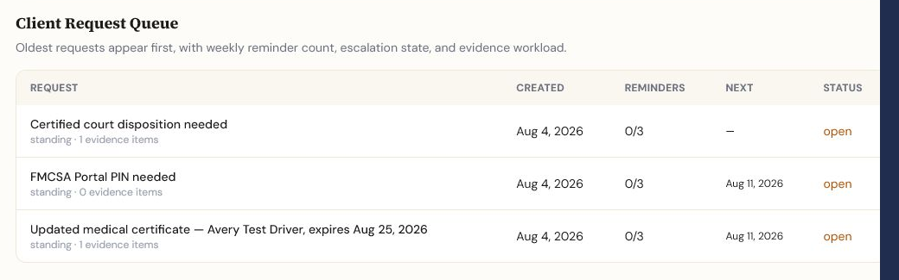

### Secure-handoff rule

- Never request or accept the PIN in ordinary email.
- Never paste it into a client request description, activity note, case narrative, report, or screenshot.
- Never store it in a generic document upload.
- During writable onboarding, the dedicated PIN field is the only implemented secure application path.
- After onboarding, the portal explicitly says secure online PIN handoff is not yet available. The console also has no staff recording control. Escalate for an approved secure method; do not improvise storage.

### Verify recording

When an approved recording path is available, the Account pill should change from No to Yes while the secret remains masked. Until the post-onboarding recording gap is fixed, a PIN request may remain open even after an off-platform conversation; do not mark it complete by falsifying another field.

---

## 7. Total Safety fulfillment

Total Safety is an operational compliance service. Its roster is not the billing source of truth.

### The billing boundary

- `clients.driver_count` is the client-attested service-plan count used for billing.
- Compliance driver rows are operational records.
- Adding, terminating, or correcting a compliance driver must never change the plan count or MRR automatically.
- If billing needs to change, use the approved subscription process separately.

### Collect before entering data

For each driver:

- full name;
- CDL number, state, class, and expiration when available;
- hire date and active/terminated status;
- employment application;
- prior-employer checks;
- road test/certificate;
- initial MVR and annual-review date;
- medical certificate and expiration;
- Clearinghouse pre-employment query evidence.

For each vehicle:

- unit number and VIN;
- year/make;
- plate/state;
- active status;
- annual DOT inspection date/document;
- maintenance history: PM service, repair, and annual inspection entries.

For Clearinghouse:

- company registration status;
- each active driver’s last annual query date, result, and optional document.

### Enter and maintain it in the console

Open `/console/clients/{client_id}/compliance`.

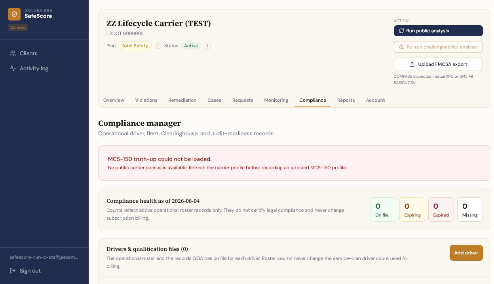

1. **Drivers & qualification files**
   - select **Add driver**;
   - enter identity, licensing, hire, and status facts;
   - open the driver’s DQF details and record each checklist item/document/date;
   - terminate rather than erase a driver whose employment ended.
2. **Vehicles & maintenance**
   - select **Add vehicle**;
   - enter unit/VIN/plate and annual inspection facts;
   - use **Log maintenance** for PM service, repair, or annual inspection work.
3. **Clearinghouse tracking**
   - set company registration status;
   - select **Record a query** for the appropriate driver and date/result.

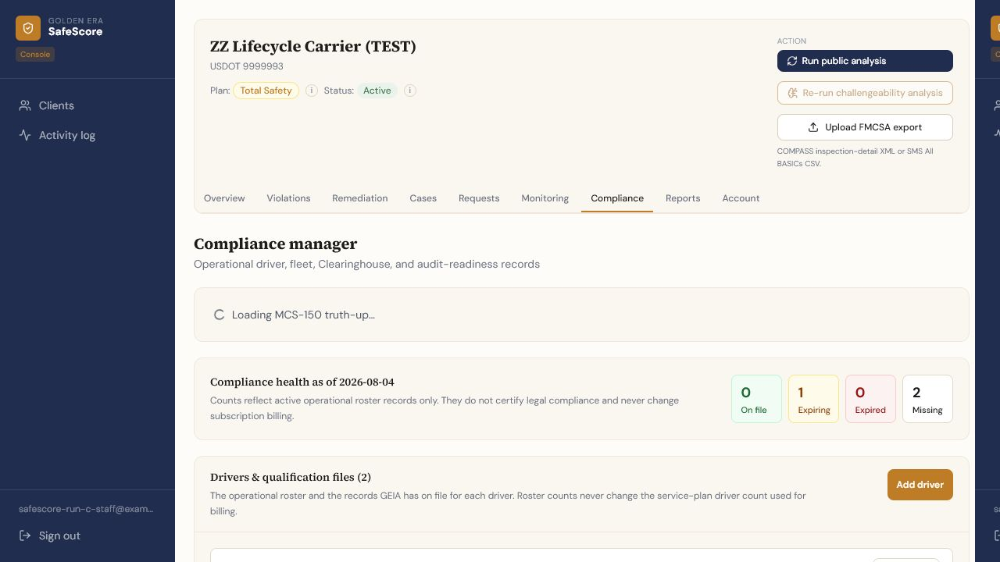

Use source documents where available. Do not mark an item On file based only on a verbal statement.

### Expiration sweep

| Item | Milestones | Operations result | Automatic client request at 30 days |
| --- | --- | --- | --- |
| CDL expiration | 60, 30, 7 days; expired | Included in one client digest/day and activity | Yes — updated CDL |
| Medical certificate | 60, 30, 7 days; expired | Included in one client digest/day and activity | Yes — updated medical certificate |
| Annual MVR review | 60, 30, 7 days; overdue | Included in one client digest/day and activity | No; GEIA manages the review |
| Annual vehicle inspection | 60, 30, 7 days; expired | Included in one client digest/day and activity | No; GEIA manages the tracking/workflow |
| Annual Clearinghouse query | 60, 30, 7 days; overdue | Included in one client digest/day and activity | No; GEIA performs the query outside SafeScore |

The sweep deduplicates milestones and sends one operations digest per client per day, not one message per item. A client renewal request title includes context, for example `Updated medical certificate — {driver name}, expires {date}`.

### What the carrier sees

Total Safety clients gain **Compliance** in portal navigation. `/portal/compliance` is read-only and shows:

- driver compliant/expiring/expired counts;
- vehicle inspection health;
- Clearinghouse status;
- upcoming expiration items;
- honest empty states until GEIA collects the roster.

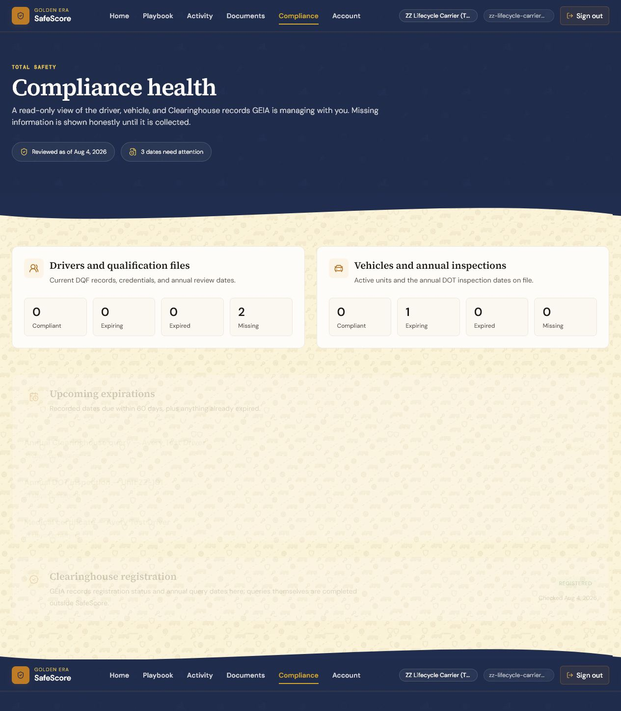

Client-owned renewal asks appear in the standard Documents **Needed from you** zone. The carrier uploads there; GEIA must still review the document and update the authoritative compliance dates/status.

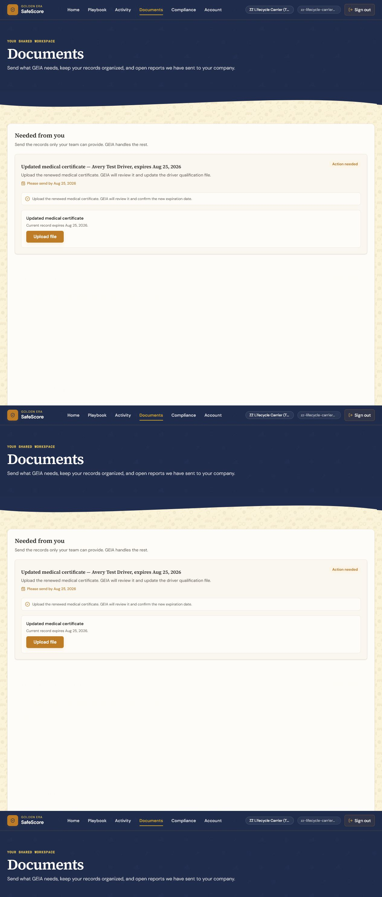

### Daily fulfillment check

1. Review the operations digest/activity.
2. Open Compliance and inspect expired, 7-day, 30-day, and 60-day items.
3. Confirm the 30-day CDL/medical request exists and has the correct person/date.
4. Review new uploads in Documents/Requests.
5. Update the checklist or expiration date only from the verified replacement document.
6. Confirm the client’s read-only portal health reflects the saved operational record.

---

## 8. Reports

### The five report types

Use the AI generator in `/console/clients/{client_id}/reports`.

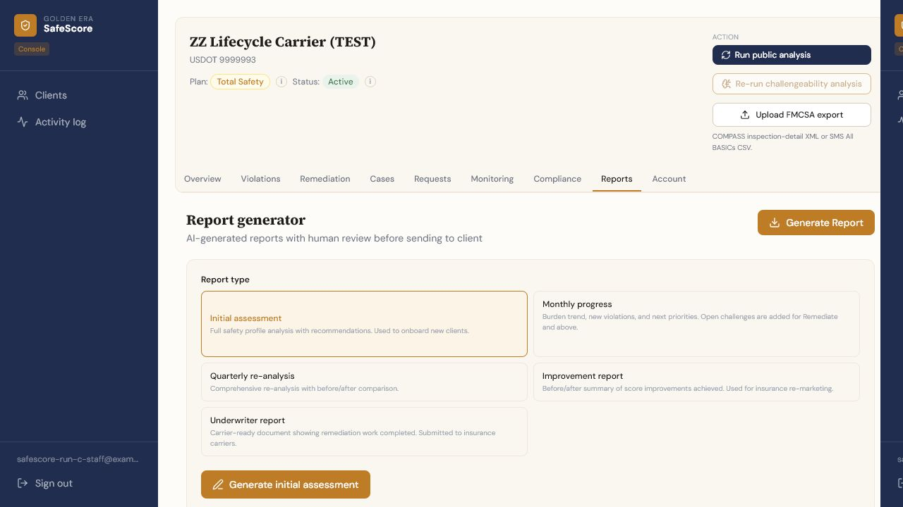

| Report type | Audience | Comparison anchor | Sections, in order |
| --- | --- | --- | --- |
| Initial assessment | Client (onboarding) | None. This report never compares the carrier with a previous period. | Safety Profile Overview; Where the Burden Sits; Crash Record; What We Recommend; What Happens Next |
| Monthly progress | Client | Snapshot closest to 30 days before the latest snapshot, provided it is at least 14 days older; otherwise this is the first reporting period. | Burden Trend; Diagnostic Snapshot; New Violations; Priority Findings; Open Challenges |
| Quarterly re-analysis | Client | Snapshot closest to 90 days before the latest snapshot, provided it is at least 45 days older; otherwise this is the first reporting period. | Burden Trend; Diagnostic Snapshot; Changes This Quarter; Priority Findings; Open Challenges |
| Improvement report | External insurance re-marketing audience | Earliest snapshot on file (the engagement baseline). | Engagement Summary; Measured Improvement; Work Performed; Current Standing |
| Underwriter report | Insurance carrier underwriting | Earliest snapshot on file (the engagement baseline). | Carrier Overview; Remediation Work Completed; Current Safety Standing; Ongoing Safety Management (Total Safety only) |

### Review ritual

1. Select the correct report type and choose **Generate report**.
2. Wait for a successful generation. A failed validation is a real failure; do not substitute placeholder text.
3. Open the new row in Report history.
4. Read the complete report against live facts:
   - carrier identity and reporting date;
   - burden total, in-window/on-file counts, and comparison period;
   - BASIC movements and new violations;
   - exact DataQ/CPDP case type, number, status, and stored description;
   - tier-appropriate sections;
   - fixed GEIA preparer block;
   - no bracket placeholders or `[VERIFY:]` tokens.
5. Confirm the report matches its type's audience — improvement and underwriter reports must contain no internal queue language and no client weakness rankings.
6. Compare the preserved AI draft with the editable final copy.
7. Select **Edit final copy**, make only supported changes, then **Save edits**.
8. Use **Print view** for a client-presentable review/PDF proof.
9. Select **Mark reviewed** only after the final copy is approved. SafeScore records reviewer and timestamp.
10. Select **Send to client**. The control appears only after review, and the server accepts only an atomic `reviewed -> sent` transition.
11. Confirm the result: the report is now visible in the portal's **From GEIA** area. When the email dry-run gate is active, no live email is sent and the confirmation reads `Marked sent — email suppressed by dry-run gate`.

The AI draft remains preserved; edits belong in final content.

### Reviewed-only send

The enforced lifecycle is `draft -> reviewed -> sent`.

- A draft cannot be sent. Edit it and mark it reviewed first.
- The Send control appears only for a reviewed report, and the server rejects every other status with `409 Conflict`.
- The status update uses `status = reviewed` as an atomic predicate. A second or stale request cannot send a duplicate notification.
- Sending changes the report to Sent and makes it portal-visible even while `EMAIL_DRY_RUN` suppresses the email. Never change report status directly in the database.
- If the status changes in another session, reload the detail view before taking another action.

The header **Generate Report** PDF button is a legacy path that creates a reviewed assessment record without the AI/final-content review split. Do not use it for client deliverables. Use the five-type generator.

### Three stacked drafts protocol

Three drafts are currently stacked for operator review. Drafts normally accumulate until sent or deliberately deleted.

1. Leave all three in place until Brandon reviews them.
2. Open them oldest first and record type, reporting period, creation time, and facts used.
3. Identify which draft is the intended canonical client report.
4. Fully review/edit that draft and mark only that one Reviewed.
5. A draft may be deleted only after the operator confirms it is obsolete or superseded. Reviewed reports cannot be deleted.
6. Send only the approved Reviewed row. Leave the others Draft until the operator deliberately deletes or reviews them; do not alter statuses as a workaround.

---

## 9. Go-live checklist

This is a documented procedure only. Do not execute it against the existing pilot carrier without explicit written authorization, an agreed maintenance window, and the named carrier contact.

### A. Legal and operational approval

- [ ] Daven approves the Terms of Service wording.
- [ ] Daven approves the DataQ/CPDP filing-authorization wording.
- [ ] GEIA confirms who may activate clients, file cases, review reports, and handle PINs.
- [ ] The reminder, report-send, CPDP-determination, playbook-publish, alert-triage, and post-onboarding PIN gaps are resolved or formally accepted with compensating procedures.
- [ ] The three stacked drafts have been reviewed under the protocol above.

### B. Email production switch

- [ ] Confirm sender/domain authentication and the operations recipient.
- [ ] Review every automated template and destination link.
- [ ] Confirm the production application URL first.
- [ ] Set production `EMAIL_DRY_RUN=false` only after human approval.
- [ ] Deploy and verify a controlled, authorized delivery event plus its activity metadata.
- [ ] Confirm no test/example address can receive live mail.

### C. Stripe live mode

- [ ] Create/confirm live products and prices for Monitor, Remediate, Total Safety, and the driver add-on.
- [ ] Set the production values for `STRIPE_SECRET_KEY`, `STRIPE_WEBHOOK_SECRET`, `STRIPE_PRICE_MONITOR`, `STRIPE_PRICE_REMEDIATE`, `STRIPE_PRICE_TOTAL_SAFETY`, and `STRIPE_PRICE_DRIVER_ADDON` without printing their values.
- [ ] Register the production `/api/billing/webhook` endpoint for `checkout.session.completed`, `checkout.session.async_payment_succeeded`, `customer.subscription.deleted`, and `invoice.payment_failed`.
- [ ] Verify signature rejection for an unsigned request.
- [ ] Complete one authorized live-mode checkout with a designated test/customer plan.
- [ ] Verify subscription, activation, first analysis, client-live delivery, and operations notification before onboarding another client.

### D. Production domain and authentication

- [ ] Add the production domain in Vercel and verify DNS/HTTPS.
- [ ] Set `NEXT_PUBLIC_APP_URL` to the final HTTPS origin.
- [ ] Update Supabase Auth Site URL and allowed redirect URLs for setup, login, and password reset.
- [ ] Update the Stripe webhook endpoint to the production origin.
- [ ] Verify `/login`, a fresh invite `/setup` link, password reset, `/console`, `/portal`, and `/api/cron/monitoring-refresh` authorization behavior.
- [ ] Confirm operations/client links resolve to the production domain rather than the Vercel preview domain.

### E. Repository and public-artifact safety

- [ ] Make the SafeScore repository private.
- [ ] Confirm branch protections and least-privilege collaborator access.
- [ ] Search history and current files for `.env` contents, setup URLs, tokens, real client identifiers, and real-client screenshots.
- [ ] Keep only synthetic screenshots in `docs/sop-assets/`.

### F. Existing pilot carrier re-onboarding

Do not rename, delete, or recreate the carrier. Everything must remain on the existing `client_id` so safety history survives.

- [ ] Record the existing client ID, tier, status, subscription state, portal users, safety-row counts, snapshots, cases, requests, reports, and compliance rows before the change.
- [ ] Confirm the real authorized carrier contact and email; do not guess.
- [ ] Establish a maintenance window because portal access will be interrupted.
- [ ] Change lifecycle status from Active to Onboarding only through the approved controlled procedure. Do not delete safety data.
- [ ] Confirm the assigned tier.
- [ ] Revoke obsolete pending invites and mint one invite for the real contact.
- [ ] Have the carrier create its own portal account and complete the wizard with real contact/fleet facts, consents, filing authorization, and current service-plan driver count.
- [ ] Use the approved Stripe or manual activation path. Do not run both.
- [ ] Verify activation restores portal access and recalculates MRR from the confirmed tier and client-stated driver count.
- [ ] Confirm historical inspections, violations, crashes, snapshots, cases, playbooks, reports, and compliance records still use the same client ID.
- [ ] Verify first post-activation refresh does not duplicate or erase enriched data.
- [ ] Verify operations notification and client-live delivery evidence.
- [ ] Walk Home, Playbook, Activity, Documents, Account, and Total Safety Compliance with the real client.

### G. Final production smoke test

- [ ] Console and portal role/session boundaries work.
- [ ] Daily monitoring reports the expected client count and a successful run.
- [ ] New alerts create operations notification evidence.
- [ ] Evidence upload links to the correct request and automatically reassesses.
- [ ] Age-out cancels only the correct open violation request.
- [ ] Total Safety sweep creates one digest/client/day and only the intended 30-day renewal asks.
- [ ] A five-type report can be generated, edited, reviewed, and sent only from Reviewed.
- [ ] Portal From GEIA lists sent reports only.
- [ ] A generated playbook’s immediate portal visibility is either accepted or replaced with a reviewed publish gate.
- [ ] No live email, Stripe charge, client invitation, filing, or status change occurs outside the approved runbook.

---

## 10. Operator Checklist

The Operator Checklist is the primary operating surface for routine SafeScore work. Start each shift with **Today** on `/console`, then open a carrier's **Checklist** before working from an individual tab. Today rolls up work that needs staff action across carriers; the client Checklist also shows work waiting on the client, work waiting on a system gate, and manual items.

> Operator checklist items are DERIVED from live data; stored todo rows drift and are forbidden. Stored state is only acks/snoozes/manual items.

### How the checklist stays truthful

- The server assembles the current client context in one batched read and evaluates deterministic rules when the Checklist or Today payload is requested. Derived work is not created by a cron job and is not stored as todo rows.
- A derived item appears while its live condition is true and auto-clears when that condition clears. Completing the linked work is the normal way to remove it.
- Monthly-report cadence is based on a Sent report in the last 30 days. The exact review sequence is: generate monthly → review → mark reviewed → Send.
- Quarterly strategic review is the intentional human-judgment exception. A Done acknowledgment applies only to the current quarter's context key; the next quarter produces a new item.
- A snooze temporarily hides only an eligible human-judgment item until its recorded date. It does not change the source record, resolve a request, acknowledge an alert, or complete a case.
- Alert acknowledgment is a read receipt, not a decision or remediation result. Read the alert against the latest snapshot and source rows first, then acknowledge that specific alert. The monitoring item clears only when no relevant unread alerts remain.
- Manual items are deliberately stored operator notes. They may be completed or soft-deleted, but they never replace a derived rule or its underlying workflow.
- A checklist error must be treated as an error. Never interpret a failed context load as an empty, completed queue.

### Rule-family guide

| Family | What it means | Where the instructions lead |
| --- | --- | --- |
| Monitoring | An unread change alert needs staff review and acknowledgment. | Follow §2: compare snapshots, inspect source rows, classify the movement, then acknowledge the alert. |
| Reporting | A scheduled report is due or generated drafts need review. | Follow §8: generate the correct type, review/edit the final copy, mark reviewed, then Send. |
| Evidence | A carrier request is waiting, escalated, or submitted for staff review. | Follow §5: inspect the linked violation/case and evidence, allow automatic reassessment where applicable, and record the honest outcome. |
| Cases | A DataQ or CPDP draft is more than seven days old, or any filed case has no recorded determination yet. | Follow §4 for CPDP and §5 for Lane B/DataQ; never infer a determination or filing authority. |
| Compliance | A Total Safety driver roster is empty, a DQF has missing items, an expiration is due within 60 days, or an annual Clearinghouse query is due. | Follow §7: verify the source document, update the operational record, and keep roster counts separate from billing. |
| Onboarding | No portal user has accepted access yet, or no baseline assessment has ever reached Sent. | Follow §3 for portal access and §8 for baseline report review and delivery. |
| Service | A quarterly strategic review needs operator judgment. | Review the carrier's current trends, cases, requests, and service priorities, then mark the quarter complete only after the review occurs. |
| Gates | A system-level condition prevents normal delivery or automation. | Follow §9 and the approved launch/runbook process; never bypass dry-run, missing integration, or test-billing safeguards. |

### Generated work versus manual work

Derived items explain a live condition, why it matters, and the next steps. Use **Go** to open the authoritative workbench; do not mark a derived item done merely to make the queue shorter. Manual items are for genuinely ad-hoc operator work that has no deterministic source condition. Before creating one, confirm that an existing rule, request, case, or compliance record does not already represent the work.

The empty state reads `Nothing needs you right now — {N} waiting on client, {M} waiting on gates.` It means no current item needs staff action; it does not mean client-owned or gate-blocked work disappeared. Read those waiting counts before ending the review.

---

## Operator escalation rule

Stop and escalate when the source record is ambiguous, the requested evidence does not match the violation, authorization is absent, a PIN would need to travel through an insecure channel, a production delivery lacks activity evidence, or the interface cannot represent the real outcome. SafeScore should surface facts and automate repeatable mechanics; Brandon remains responsible for the operational judgment.
